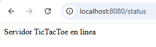

# Parcial Práctico 2 tercio ARSW

## Juan David Zambrano Gonzalez

---

### 1. Aprenda a construir un Juego Tic Tac Toe siguiendo el tutorial que se indica aquí: https://reactjs.org/tutorial/tutorial.html#before-we-start-the-tutorial 
## ([Repositorio ya construido](https://github.com/juanzambranog/Frontend_Tic-Tac-Toe_Parcial_ARSW.git))


### 2. A partir de este Juego construya una aplicación interactiva usando WebSockets que permita:

Creamos el servidor donde correra el juego

### Controlador

```java
package edu.eci.controllers;

import org.springframework.web.bind.annotation.GetMapping;
import org.springframework.web.bind.annotation.RequestMapping;
import org.springframework.web.bind.annotation.RestController;

@RestController
//@RequestMapping("/api/game")
public class GameController {

    @GetMapping("/")
    public String home() {
        return "Servidor en línea";
    }

    @GetMapping("/status")
    public String status() {
        return "Servidor TicTacToe en línea";
    }

    @GetMapping("/board")
    public String getBoard() {
        return String.join(",", getBoard());
    }
}
```

### Starter

``` java
package edu.eci;

import java.util.Collections;

import org.springframework.boot.SpringApplication;
import org.springframework.boot.autoconfigure.SpringBootApplication;
@SpringBootApplication
public class WebsocketsApplication {
public static void main(String[] args){
SpringApplication app = new SpringApplication(WebsocketsApplication.class);
app.setDefaultProperties(Collections
.singletonMap("server.port", getPort()));
app.run(args);
}
static int getPort() {
if (System.getenv("PORT") != null) {
return Integer.parseInt(System.getenv("PORT"));
}
return 8080; //returns default port if PORT isn't set (i.e. on localhost)
}
}
```

### Corremos con:

> mvn clean install

> mvn spring-boot:run


**Revisamos estatus**



**Revisamos Home "/"**


#### 1. Crear una sala


#### 2. Entrar a una sala


### 3. Jugar a dos jugadores en forma interactiva una partida de Tic Tac Toe


#### Para esta parte debemos modificar el componente pricipal ***Game.jsx*** de nuestro frontend, adecuandolo y haciendo la conexion al servidor-socket que acabamos de crear.

### Modificamos el codigo "Actual"

``` jsx
import { useState } from 'react'
import Board from './Board'
import { calculateWinner } from '../utils/gameUtils'

export default function Game() {
  const [history, setHistory] = useState([Array(9).fill(null)])
  const [currentMove, setCurrentMove] = useState(0)

  const xIsNext = currentMove % 2 === 0
  const currentSquares = history[currentMove]

  const { winner, line } = calculateWinner(currentSquares)

  function handlePlay(nextSquares) {
    const nextHistory = [...history.slice(0, currentMove + 1), nextSquares]
    setHistory(nextHistory)
    setCurrentMove(nextHistory.length - 1)
  }

  function jumpTo(move) {
    setCurrentMove(move)
  }

  const moves = history.map((squares, move) => {
    let description
    if (move === currentMove) {
      description = `Estás en el movimiento #${move}`
    } else if (move > 0) {
      description = `Ir al movimiento #${move}`
    } else {
      description = "Ir al inicio del juego"
    }

    return (
      <li key={move}>
        {move === currentMove ? (
          <span className="current-move">{description}</span>
        ) : (
          <button onClick={() => jumpTo(move)}>{description}</button>
        )}
      </li>
    )
  })

  return (
    <div className="game">
      <div className="game-board">
        <Board
          xIsNext={xIsNext}
          squares={currentSquares}
          onPlay={handlePlay}
          winningLine={line}
        />
        {winner && <div className="winner">¡Ganador: {winner}!</div>}
      </div>
      <div className="game-info">
        <ol>{moves}</ol>
      </div>
    </div>
  )
}

```


### Por el siguiente:

``` jsx
import { useState, useEffect } from 'react'
import Board from './Board'
import { calculateWinner } from '../utils/gameUtils'

export default function Game() {
  const [history, setHistory] = useState([Array(9).fill(null)])
  const [currentMove, setCurrentMove] = useState(0)
  const [socket, setSocket] = useState(null)

  const xIsNext = currentMove % 2 === 0
  const currentSquares = history[currentMove]

  const { winner, line } = calculateWinner(currentSquares)


  function resetGame() {
    setHistory([Array(9).fill(null)]);
    setCurrentMove(0);

    if (socket && socket.readyState === WebSocket.OPEN) {
      socket.send(JSON.stringify({ type: "RESET" }));
    }
  }


  function handlePlay(nextSquares) {
    const nextHistory = [...history.slice(0, currentMove + 1), nextSquares];
    setHistory(nextHistory);
    setCurrentMove(nextHistory.length - 1);

    if (socket && socket.readyState === WebSocket.OPEN) {
      // Enviar jugada al backend como un tablero completo o índice
      const index = nextSquares.findIndex((val, i) => val !== currentSquares[i]);
      socket.send(JSON.stringify({
        type: "MOVE",
        index: index,
        board: nextSquares
      }));    }
  }


  function jumpTo(move) {
    setCurrentMove(move)
  }


  //conexion websocket
  useEffect(() => {
    const ws = new WebSocket("ws://localhost:8080/game");
    setSocket(ws);

    ws.onopen = () => {
      console.log("Conectado al servidor WebSocket");
    };

    ws.onmessage = (event) => {
    const data = JSON.parse(event.data);

    if (data.type === "RESET") {
      setHistory([Array(9).fill(null)]);
      setCurrentMove(0);
      return;
    }

    if (data.type === "MOVE" && data.board) {
      setHistory([data.board]);
      setCurrentMove(0);
    }
    };

    ws.onclose = () => {
      console.log("Conexión WebSocket cerrada");
    };

    return () => ws.close();
  }, []);


  const moves = history.map((squares, move) => {
    let description
    if (move === currentMove) {
      description = `Estás en el movimiento #${move}`
    } else if (move > 0) {
      description = `Ir al movimiento #${move}`
    } else {
      description = "Ir al inicio del juego"
    }

    return (
      <li key={move}>
        {move === currentMove ? (
          <span className="current-move">{description}</span>
        ) : (
          <button onClick={() => jumpTo(move)}>{description}</button>
        )}
      </li>
    )


  })


return (
  <div className="game">
    <div className="game-board">
      <Board
        xIsNext={xIsNext}
        squares={currentSquares}
        onPlay={handlePlay}
        winningLine={line}
      />
      {winner && <div className="winner">¡Ganador: {winner}!</div>}

      <button className="reset-button" onClick={resetGame}>
        Reiniciar juego
      </button>
    </div>

    <div className="game-info">
      <ol>{moves}</ol>
    </div>
  </div>
);


}
```

#### ***Aqui hacemos la conexion con GameHandler y la conexion al servidor-websocket por la url     const ws = new WebSocket("ws://localhost:8080/game");***


### Verificamos la funcionalidad de la forma interactiva para dos jugadores, para esto como tenemos repositorios separados debemos asegurarnos de estar corriendo los dos.

### Frontend

> npm install

> npm run dev


### Servidor-Websocket

> mvn clean install

> mvn spring-boot:run


#### Una vez ambos esten corriendo verificamos la funcionalidad abriendo la direccion donde esta corriendo el **Frontend** en don navegadores, en este caso fue ***Microsoft Edge*** y una pestaña de ***Google en incognito***


#### Como se puede ver en la imagen la funcionalidad interactiva para dos jugadores funciona correctamente.


### Despliegue 

***Ya que desplegamos ambas partes en Azure con un App Service debemos cambiar la URL del Game.jsx que se comunica con el Websocket***


#### 4. El sistema debe persistir las salas y el estado de Juego a una base de datos.


#### 5. El sistema debe permitir retroceder en la historia en cada sala. Una sala recuperada de la base de datos debe traer sus historia y permitir por ejemplo retroceder en el juego normalmente.


Al lado del tablero se encontraran los movimientos realizados durante la partida, al hacer click en estos se nos dirigira al momento de la partida en ese punto


### BONO: Desplegado en la nube.

#### WebSocket 

Desplegamos el servidor en Azure con un App Services


***https://websockets-h2b5d4duhddmh2er.westeurope-01.azurewebsites.net/***

#### Frontend

Desplegamos el frontend en Azure con un App Services


***https://frontendtictactoe-f6bthsgzgxcehqcx.eastus-01.azurewebsites.net/***


